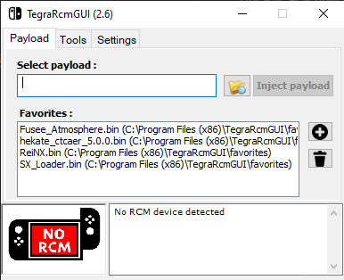

# Руководство по запуску payload через TegraRcmGUI. 
## Введение
Данное руководство является пошаговой инструкцией по запуску payload для Nintendo Switch с помощью утилиты TegraRcmGUI через ПК.

Если консоль не включается обычным способом, её можно запустить с помощью payload через ПК. Для её запуска вам понадобится загрузочный файл payload и программа, которая доставит этот файл к консоли. TegraRcmGUI – это вспомогательная утилита, которая внедряет payload (другими словами, загрузчик) в консоль, чтобы та запустилась.

Прежде чем приступать к запуску payload, убедитесь, что у вас подготовлена SD-карта с кастомной прошивкой (например, Atmosphere). Также убедитесь, что консоль заряжена и действительно не включается нажатием кнопки Power.

## Инструкция

1. Зарядите Nintendo Switch. Держите консоль на зарядке не менее трех часов
2. Скачайте и запустите последнюю версию утилиты [TegraRcmGUI](https://github.com/eliboa/TegraRcmGUI/releases)
3. Переведите Nintendo Switch в режим RCM

Для этого:
- консоль должна быть полностью выключена  
- используйте джиг или другой способ замыкания контактов  
- зажмите кнопку Volume + и нажмите Power  

Экран останется чёрным — это нормально
4. Подключите Nintendo Switch к компьютеру через провод USB Type-C. Красная иконка NO RCM сменится на зелёную RCM ON, когда утилита обнаружит подключённую консоль

5. В окне Favorites найдите payload, соответствующий вашему типу прошивки и выберите его двойным кликом мыши
6. 5. После отправки payload консоль загрузится (например, в меню загрузчика или кастомной прошивки)

## FAQ 

### 1. Nintendo Switch подключён, но утилита его не видит (горит иконка NO RCM)

 Возможные причины:

- Консоль выключена или разряжена. Зажмите кнопку POWER на 30 секунд, затем отпустите и нажмите ещё раз. Если не сработало – поставьте Nintendo Switch на зарядку минимум на три часа и повторите процедуру;
- Провод USB Type-C неисправен. Замените провод;
- *Прежде, чем переходить к этому пункту, следует опробовать предыдущие способы решения проблемы*. Консоль неисправна.  Это возможно в случае совершения критических ошибок при прошивке консоли. Отдайте Nintendo Switch в ремонт. К сожалению, с высокой долей вероятности это состояние необратимо;

### 2. В окне Favorites отсутствуют файлы payload

Утилита TegraRcmGUI чаще всего уже включает в себя файлы payload для запуска консоли. Если файлы отсутствуют, выберете нужный файл через обозреватель в секции *Select payload*. Если на компьютере файлы отсутствуют, скачайте нужный payload по ссылке: https://github.com/ctcaer/hekate/releases

### 3. Активация payload не запускает консоль

Убедитесь, что TegraRcmGUI обнаружила подключённую консоль.

Если консоль подключена правильно, убедитесь, что выбран нужный payload. Самый распространённый payload – *hekate_ctcaer*, однако для разных прошивок он может отличаться.