# Руководство к пользованию GM-тулзой

## Предисловие
Это руководство было создано для внутренней GM-утилиты. Оригинальный текст был переработан, а скриншоты тулзы заменены воссозданными в Figma аналогами в целях нераспространения внутрикорпоративной документации.

## Содержание
[Запуск тулзы и поиск](#1-запуск-тулзы-и-поиск)

[Персонажи](#2-персонажи)

[Предметы](#3-предметы)

[Игровая валюта](#4-игровая-валюта)

[Чат](#5-чат)

[Логи событий](#6-логи-событий)

[Возврат предметов](#7-возврат-предметов)

[Гильдии](#8-гильдии)

[Решение проблемы с отсутствием названий предметов в логах](#9-решение-проблемы-с-отсутствием-названий-предметов-в-логах)

## 1. Запуск тулзы и поиск 
Для работы тулзы необходим рабочий VPN. Без него тулза работать не будет.
Откройте файл tool.exe из директории C:/Users/User/Documents/gm-tool

После запуска тулзы необходимо выбрать сервер и аккаунт.

Поиск доступен по логину и по айди персонажа.

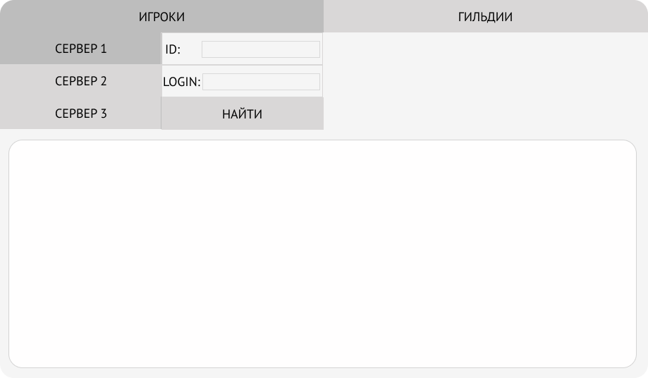
  
После нажатия "Найти" тулза находит доступную информацию об аккаунте и показывает её в нижнем окне.

Секция Account показывает ID и онлайн/оффлайн статус аккаунта.

Окно ниже показывает информацию, выводит список доступных и удалённых персонажей.

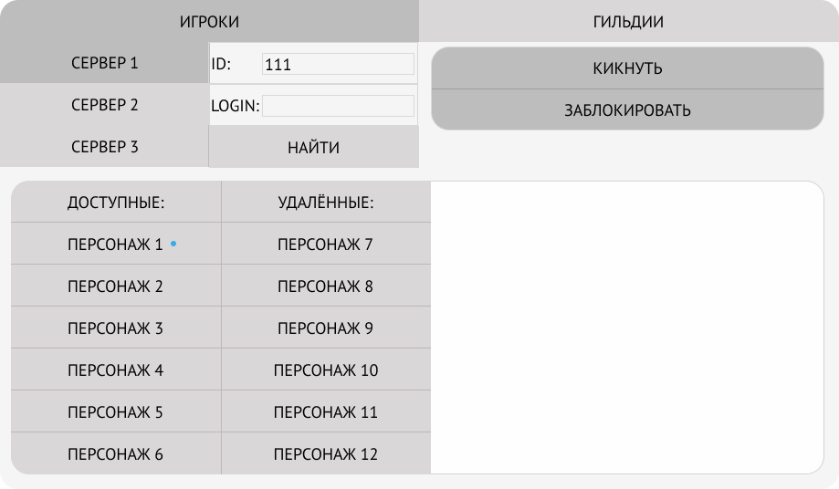

Поиск по имени логину покажет ID, на котором находится персонаж.

## 2. Персонажи

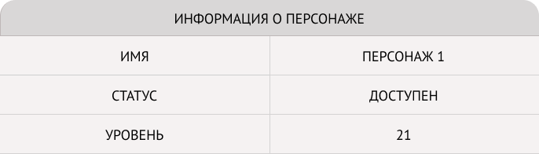

При выборе персонажа откроется окно с базовой информацией о нём.

Клик правой кнопкой мыши по окну с информацией покажет дополнительные данные.

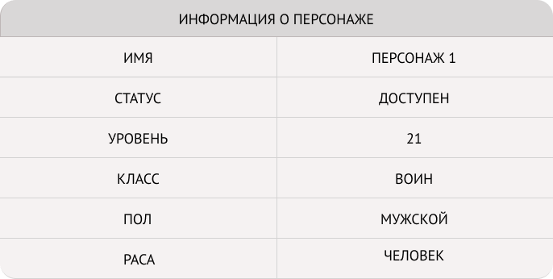

При выборе аккаунта вместо персонажа, gm-tool покажет всю доступную информацию со всех персонажей.

Информация включает в себя предметы, игровую валюту, переписку в чате и события в игре.

## 3. Предметы

Нажмите правой кнопкой мыши по секции Информация о персонаже и выберите Предметы. GM-tool отобразит вкладку с предметами. Доступные хранилища: Клейм, Хранилище персонажа, Банк.

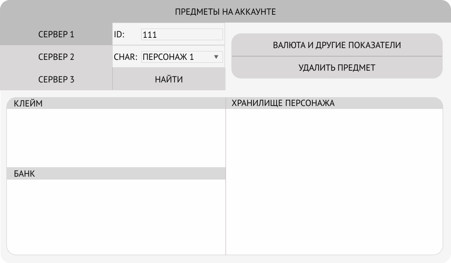

Навигация по персонажам происходит с помощью выпадающего списка в поле CHAR.
## 4. Игровая валюта

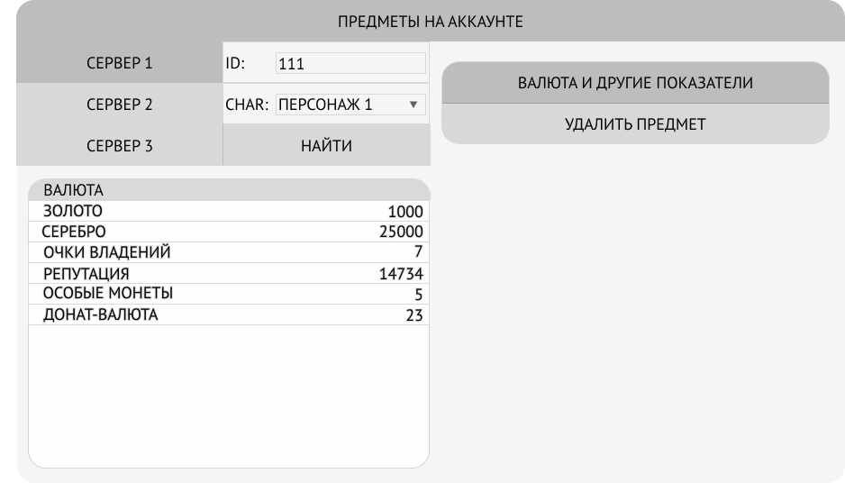

В секции Валюта и другие показатели отображено количество золота, серебра, очков владений, репутация, особые монеты и донат-валюта.

## 5. Чат
Нажмите правой кнопкой мыши по секции Информация о персонаже и выберите Chat.

Для поиска логов чата сперва выберите требуемый временной диапазон. Срок сохранности логов, доступных для поиска — два месяца.

В левом верхнем окне находятся фильтры каналов чата, в нижнем показаны сообщения.

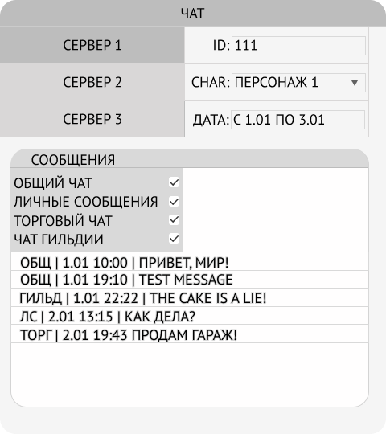

## 6. Логи событий

Нажмите правой кнопкой мыши по секции Информация о персонаже и выберите Events  log.

Для поиска логов чата сперва выберите требуемый временной диапазон. Срок сохранности логов, доступных для поиска — два месяца.

Логи показывают действия всех персонажей, если был выбран аккаунт, либо показывать действия конкретного выбранного персонажа, если выбрать его соответственно.

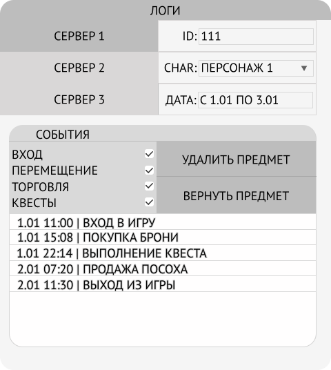

В левом верхнем окне находится фильтр событий. События фильтруются путём выбора требуемых чекбоксов.

## 7. Возврат предметов

Для возврата предметов необходимо обладать специальными правами, которые есть у разработчиков.

Пропавшие вещи в логах событий выделены синим цветом.

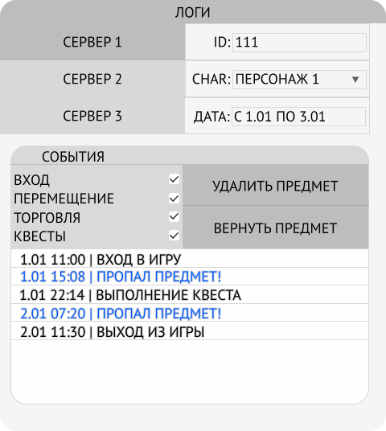

Для возврата необходимо нажать на лог с предметом правой кнопкой мыши (или выбрать несколько предметов, если необходимо) и выбрать опцию “Вернуть предмет” и подтвердить возврат во всплывшем окне.

В случае отсутствия прав на возврат вы получите ошибку:

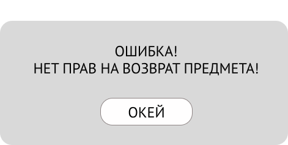

## 8. Гильдии

На текущем уровне доступа возможен только просмотр участников и их ранга.

Вкладка Гильдии на стартовом экране GM-Tool позволяет искать гильдии по их названию.
Для поиска выберите сервер и введите название гильдии.
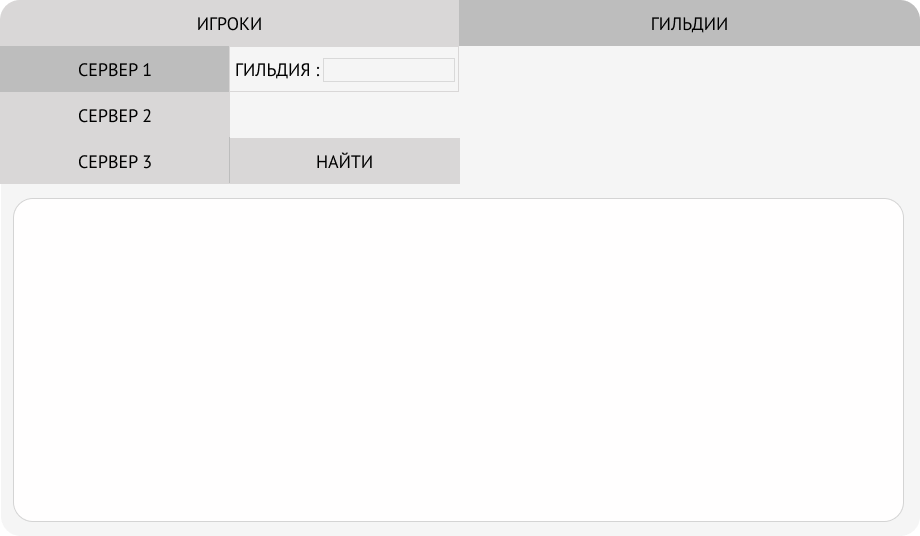

Если клан с таким названием существует, появится окно со списком членов гильдии и их рангами

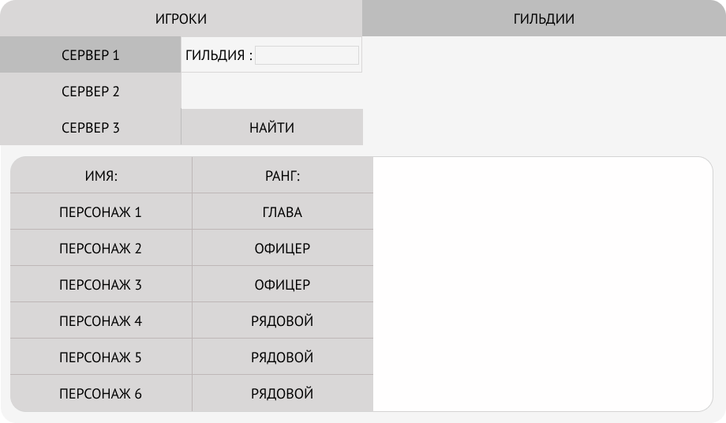

## 9. Решение проблемы с отсутствием названий предметов в логах

Утилита загружает названия предметов из директории из директории Game\support\language\items

В случае пропуска некоторых имен требуется обновить папку items до актуального состояния.